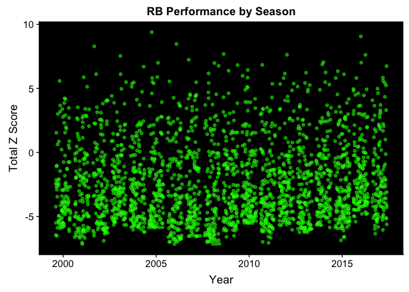
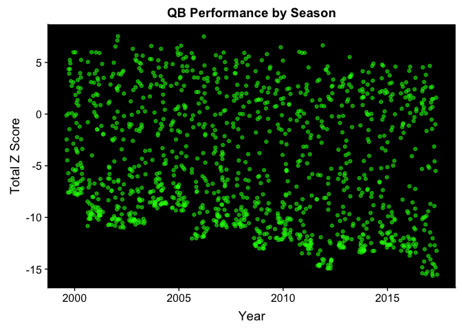
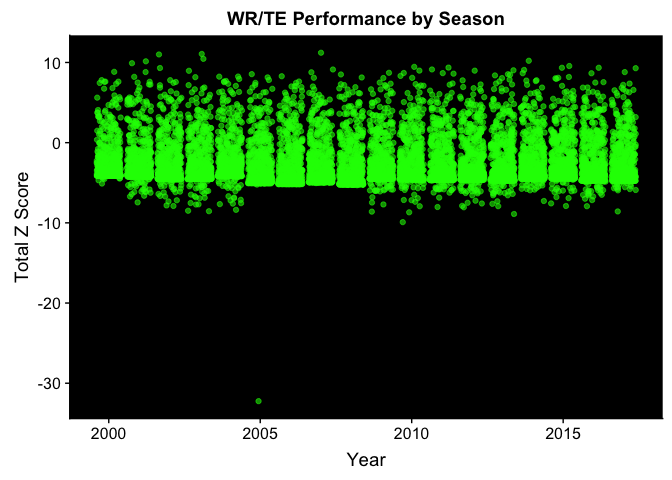
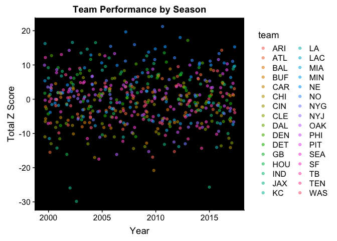

<!-- README.md is generated from README.Rmd. Please edit that file -->
GitHub README
=============

This project is a reproducible R project that is analyzing data collected from the National Football League (NFL) between the 2000 and 2017 seasons. Traditionally, most statistics in sports are compared based on the raw totals (e.g., comparing the number of career passing yards between players). The unfortunate downfall of such an approach is that the trends in the league differ, and as a result, players’ raw statistical totals may reflect those trends. For example, players who played in the early decades of the NFL were playing in a rushing dominant context, whereas players now are playing in a passing dominant context.

This statistical analysis will attempt to serve as a basis for comparing players’ statistical totals regardless of when each player played. This will be done by calculating z-scores based on the yearly statistics for all statistical categories. Subsequently, yearly totals can be calculated by summing all of the variables for each year. Then, yearly totals can be compared across years, and yearly totals can be summed to calculate career totals based off of those z-scores.

Data Analysis Questions
=======================

In comparing sports statistics over long periods of time, it is often difficult to make direct comparisons given contextual changes in styles of gameplay over time. This data analysis seeks to use z-scores to allow for comparison across years. This data analysis will utilize z-score comparisons to demonstrate which players have had the most prolific seasons and careers. Similarly, team data will be analyzed to see which teams have had the most prolific seasons.

Data Analysis Findings
======================

Because of the significant differences between positions, the season and career results are delineated by position. The three positions examined are quarterback, running back, and receiving positions (wide receivers and tight ends). The team season statistics are an amalgamation of the performances from these three positions.

Running backs
-------------

### Running back season performances

|         name        | game\_year |  totalZ  |
|:-------------------:|:----------:|:--------:|
|   Shaun Alexander   |    2005    | 9.396400 |
|   Ezekiel Elliott   |    2016    | 9.059064 |
| LaDainian Tomlinson |    2006    | 8.463116 |
|    Priest Holmes    |    2002    | 8.280920 |
|    Chris Johnson    |    2009    | 7.687760 |
|   Adrian Peterson   |    2012    | 7.624680 |
|     LeSean McCoy    |    2016    | 7.617993 |
|    Priest Holmes    |    2003    | 7.535735 |
| LaDainian Tomlinson |    2007    | 7.236162 |
|    Marshawn Lynch   |    2014    | 7.047300 |
|  LeGarrette Blount  |    2016    | 7.016185 |
|    Larry Johnson    |    2005    | 6.998034 |
|    Michael Turner   |    2008    | 6.980458 |
|     Le'Veon Bell    |    2014    | 6.876420 |
|     LeSean McCoy    |    2011    | 6.833676 |
|  Maurice Jones-Drew |    2009    | 6.821519 |
|  DeAngelo Williams  |    2008    | 6.765229 |
|     Todd Gurley     |    2017    | 6.738356 |
|    Curtis Martin    |    2004    | 6.693928 |
|     Arian Foster    |    2010    | 6.442276 |
|     Thomas Jones    |    2009    | 6.376879 |
|   Adrian Peterson   |    2015    | 6.342194 |
|    Justin Forsett   |    2014    | 6.242540 |
|     LeSean McCoy    |    2013    | 6.225777 |
|   Adrian Peterson   |    2008    | 6.167557 |
|    Marshawn Lynch   |    2012    | 6.154519 |
| LaDainian Tomlinson |    2002    | 6.113230 |
|    Clinton Portis   |    2003    | 6.106313 |
|   Devonta Freeman   |    2015    | 6.102361 |
|    Michael Turner   |    2010    | 5.983059 |

### Running back career performances

|         name        |  careerZ  |
|:-------------------:|:---------:|
| LaDainian Tomlinson | 46.296584 |
|     LeSean McCoy    | 31.361847 |
|      Frank Gore     | 30.376116 |
|    Marshawn Lynch   | 21.715107 |
|    Steven Jackson   | 20.664845 |
|    Curtis Martin    | 19.877084 |
|    DeMarco Murray   | 19.241044 |
|  Maurice Jones-Drew | 18.814823 |
|     Le'Veon Bell    | 18.000491 |
|    Clinton Portis   | 17.951907 |
|      Matt Forte     | 17.070211 |
|   Shaun Alexander   | 16.836544 |
|     Tiki Barber     | 16.736283 |
|     Todd Gurley     | 15.534966 |
|     Jamal Lewis     | 15.354591 |
|    Priest Holmes    | 14.747792 |
|    Alfred Morris    | 14.692201 |
|    Chris Johnson    | 14.408601 |
|     Corey Dillon    | 14.058432 |
|    Edgerrin James   | 12.691664 |
|       Ray Rice      | 12.627020 |
|   Devonta Freeman   | 11.587318 |
|     Thomas Jones    | 11.436691 |
|   Ezekiel Elliott   | 11.251278 |
|   Latavius Murray   | 11.103409 |
|     Mark Ingram     |  9.791297 |
|    Jordan Howard    |  9.726172 |
|     Lamar Miller    |  9.606091 |
|    Marshall Faulk   |  8.558008 |
|    Jerome Bettis    |  8.504632 |

According to this analysis, Shaun Alexander's performance from 2005 is the best running back single season performance within the analysis window. As can be seen from the graph as well as the table of season performances, there are many single season performances that are ranked closely behind. In regards to the most prolific running back career within the analysis window, LeDainian Tomlinson is clearly above his peers in terms of career performance. That being said, LeSean McCoy and Frank Gore also appear to be outliers in terms of career performance in relation to their peers.

Quarterbacks
------------

### Quarterback season performances

|       name       | game\_year |  totalZ  |
|:----------------:|:----------:|:--------:|
|   Drew Bledsoe   |    2002    | 7.532874 |
|     Jon Kitna    |    2006    | 7.511712 |
|    Rich Gannon   |    2002    | 7.125823 |
|    Drew Brees    |    2012    | 6.652369 |
|    Brett Favre   |    2005    | 6.619503 |
|  Peyton Manning  |    2004    | 6.590642 |
|  Peyton Manning  |    2002    | 6.539504 |
|    Drew Brees    |    2010    | 6.470294 |
|   Drew Bledsoe   |    2005    | 6.387576 |
|  Matt Hasselbeck |    2003    | 6.316913 |
| Daunte Culpepper |    2004    | 6.315383 |
|   Aaron Rodgers  |    2011    | 6.022466 |
|  Peyton Manning  |    2001    | 5.989279 |
|   Mark Brunell   |    2000    | 5.983798 |
| Daunte Culpepper |    2000    | 5.976610 |
|     Tom Brady    |    2005    | 5.973714 |
|   Aaron Brooks   |    2001    | 5.972289 |
|     Jon Kitna    |    2007    | 5.957117 |
| Matthew Stafford |    2011    | 5.932312 |
|    Drew Brees    |    2011    | 5.929999 |
|    Drew Brees    |    2008    | 5.926566 |
|    Kurt Warner   |    2001    | 5.912806 |
|    Marc Bulger   |    2006    | 5.901010 |
|   Carson Palmer  |    2005    | 5.825263 |
|    Jay Cutler    |    2009    | 5.804709 |
|    David Carr    |    2005    | 5.720611 |
|     Tony Romo    |    2007    | 5.696663 |
|   Brad Johnson   |    2003    | 5.691436 |
|    Brett Favre   |    2003    | 5.648670 |
|    Kurt Warner   |    2008    | 5.575084 |

### Quarterback career performances

    kable(head(qbCareer, 30), booktabs = TRUE, format = 'markdown', align = 'c',
            caption = 'A table of the top 30 quarter backs by career.')

According to this analysis, Drew Bledsoe's performance from 2002 is the best quarterback single season performance within the analysis window. Similar to the situation with the running backs, there are numerous other quarterbacks with similar single season performances. In regards to the most prolific quarterback career within the analysis window, Peyton Manning has the highest career rating amongst the quarterbacks. Once again, there appear to be several other quarterbacks who are outliers amongst their peers. These other outliers include notable quarterbacks such as Drew Brees, Brett Favre, Tom Brady, and Ben Roethlisberger.

Receiving
---------

### Receiving season performances

|        name       | game\_year |   totalZ  |
|:-----------------:|:----------:|:---------:|
|     Randy Moss    |    2007    | 11.212859 |
|     Torry Holt    |    2003    | 11.064827 |
|  Marvin Harrison  |    2002    | 10.999689 |
|     Randy Moss    |    2003    | 10.455140 |
|    Jordy Nelson   |    2014    | 10.211719 |
|  Marvin Harrison  |    2001    | 10.145519 |
|   Terrell Owens   |    2001    |  9.909942 |
|   Odell Beckham   |    2015    |  9.556724 |
|   Brandon Lloyd   |    2010    |  9.452748 |
|   Rob Gronkowski  |    2011    |  9.362940 |
|   Antonio Brown   |    2016    |  9.340415 |
|  DeAndre Hopkins  |    2015    |  9.339751 |
|   Terrell Owens   |    2002    |  9.308098 |
|   Antonio Brown   |    2017    |  9.288128 |
|     Wes Welker    |    2011    |  9.129715 |
|   Terrell Owens   |    2007    |  9.125784 |
|  Demaryius Thomas |    2014    |  9.069823 |
|  Demaryius Thomas |    2013    |  9.026323 |
|    Dwayne Bowe    |    2010    |  8.982848 |
|  Brandon Marshall |    2012    |  8.978081 |
|    Chad Johnson   |    2003    |  8.962392 |
| Derrick Alexander |    2000    |  8.833590 |
|     Rod Smith     |    2001    |  8.808158 |
|  DeAndre Hopkins  |    2017    |  8.802455 |
|  Braylon Edwards  |    2007    |  8.776615 |
|   Andre Johnson   |    2009    |  8.712667 |
|   Calvin Johnson  |    2010    |  8.689822 |
|    Jordy Nelson   |    2011    |  8.671685 |
|     Dez Bryant    |    2014    |  8.661357 |
|     Mike Evans    |    2016    |  8.655822 |

### Receiving career performances

|       name       |  careerZ |
|:----------------:|:--------:|
|   Terrell Owens  | 74.87611 |
|   Tony Gonzalez  | 69.42684 |
| Larry Fitzgerald | 61.70233 |
|   Reggie Wayne   | 61.15203 |
|    Randy Moss    | 58.52065 |
|  Marvin Harrison | 57.81191 |
|    Torry Holt    | 56.32419 |
|   Andre Johnson  | 52.16530 |
| Brandon Marshall | 51.41775 |
|  Calvin Johnson  | 50.59429 |
|   Anquan Boldin  | 50.47540 |
|   Chad Johnson   | 50.06504 |
|   Antonio Gates  | 49.86051 |
|    Hines Ward    | 49.69162 |
|    Steve Smith   | 48.74707 |
|    Roddy White   | 44.06518 |
|   Derrick Mason  | 43.12359 |
|   Jason Witten   | 42.73098 |
|  Marques Colston | 38.15447 |
|  Rob Gronkowski  | 37.61822 |
|    A.J. Green    | 37.60659 |
|   Greg Jennings  | 37.44153 |
|    Wes Welker    | 37.17323 |
|   Mike Wallace   | 36.49963 |
|  DeSean Jackson  | 36.34670 |
| Laveranues Coles | 35.57661 |
|     Joe Horn     | 35.02211 |
|    Julio Jones   | 34.90288 |
|   Donald Driver  | 33.43637 |
|   Antonio Brown  | 33.36275 |

According to this analysis, Randy Moss' performance from 2007 is the best receiving single season performance within the analysis window. In regards to the most prolific receiving career within the analysis window, Terrell Owens narrowly claimed the top honor ahead of Tony Gonzalez. Unlike the running back and quarterback categories, there does not appear to be the same clear differentiation between several the elite players and the very good players.

Team
----

### Team offensive season performances

| team | game\_year |  totalZ  |
|:----:|:----------:|:--------:|
|  NO  |    2011    | 21.24552 |
|  NE  |    2007    | 19.67255 |
|  NE  |    2012    | 18.04212 |
|  DEN |    2013    | 17.18786 |
|  KC  |    2002    | 16.57952 |
|  IND |    2004    | 16.53028 |
|  LA  |    2000    | 16.25909 |
|  NO  |    2008    | 15.94853 |
|  NO  |    2006    | 15.43326 |
|  NE  |    2011    | 15.32915 |
|  NE  |    2017    | 15.27659 |
|  NE  |    2010    | 14.68671 |
|  KC  |    2004    | 14.62648 |
|  ATL |    2016    | 14.30266 |
|  OAK |    2002    | 14.26848 |
|  NE  |    2009    | 13.76251 |
|  GB  |    2011    | 13.54056 |
|  KC  |    2003    | 13.49745 |
|  NO  |    2016    | 13.33315 |
|  PHI |    2006    | 13.32303 |
|  SF  |    2001    | 13.05347 |
|  CIN |    2005    | 13.02539 |
|  MIN |    2004    | 12.91946 |
|  DEN |    2000    | 12.73559 |
|  SEA |    2005    | 12.66848 |
|  IND |    2009    | 12.65475 |
|  SF  |    2000    | 12.17154 |
|  NO  |    2012    | 12.10749 |
|  IND |    2006    | 12.05203 |
|  GB  |    2004    | 11.62776 |

According to this analysis, the best team offensive performance was done by the New Orleans Saints in 2011. Other notable offensive team performances were achieved by the New England Patriots (2007, 2012), and Denver (2013).

Of note, the interpretations of these findings, especially the findings regarding individual players, must be interpreted with caution given the limited window of analysis for this data project. The window of analysis only extends from 2000 through 2017. This means that players whose entire careers are not contained within this window may have been underestimated. Furthermore, the majority of players in the NFL's history have played outside of this window. Thus, this is a limited view into the best statistical seasons and careers.
