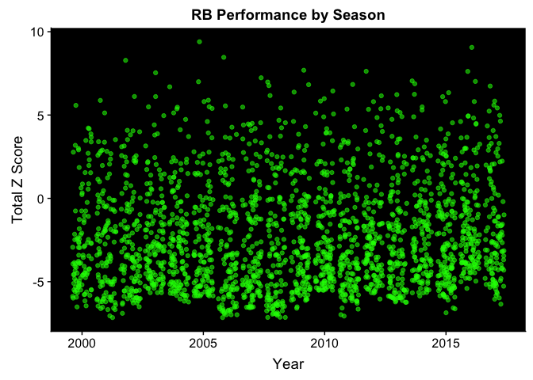
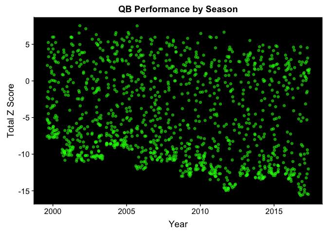
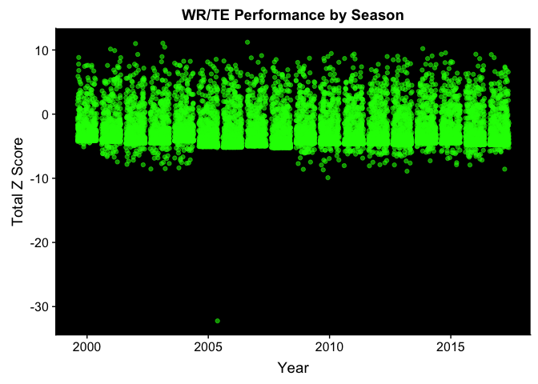
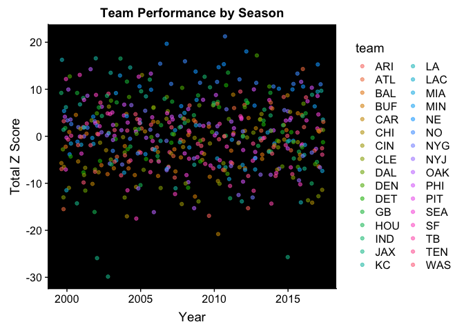

<table>
<caption>
A table of the top 30 running back performances by season.
</caption>
<thead>
<tr>
<th style="text-align:left;">
name
</th>
<th style="text-align:right;">
game\_year
</th>
<th style="text-align:right;">
totalZ
</th>
</tr>
</thead>
<tbody>
<tr>
<td style="text-align:left;">
Shaun Alexander
</td>
<td style="text-align:right;">
2005
</td>
<td style="text-align:right;">
9.396400
</td>
</tr>
<tr>
<td style="text-align:left;">
Ezekiel Elliott
</td>
<td style="text-align:right;">
2016
</td>
<td style="text-align:right;">
9.059064
</td>
</tr>
<tr>
<td style="text-align:left;">
LaDainian Tomlinson
</td>
<td style="text-align:right;">
2006
</td>
<td style="text-align:right;">
8.463116
</td>
</tr>
<tr>
<td style="text-align:left;">
Priest Holmes
</td>
<td style="text-align:right;">
2002
</td>
<td style="text-align:right;">
8.280920
</td>
</tr>
<tr>
<td style="text-align:left;">
Chris Johnson
</td>
<td style="text-align:right;">
2009
</td>
<td style="text-align:right;">
7.687760
</td>
</tr>
<tr>
<td style="text-align:left;">
Adrian Peterson
</td>
<td style="text-align:right;">
2012
</td>
<td style="text-align:right;">
7.624680
</td>
</tr>
<tr>
<td style="text-align:left;">
LeSean McCoy
</td>
<td style="text-align:right;">
2016
</td>
<td style="text-align:right;">
7.617993
</td>
</tr>
<tr>
<td style="text-align:left;">
Priest Holmes
</td>
<td style="text-align:right;">
2003
</td>
<td style="text-align:right;">
7.535735
</td>
</tr>
<tr>
<td style="text-align:left;">
LaDainian Tomlinson
</td>
<td style="text-align:right;">
2007
</td>
<td style="text-align:right;">
7.236162
</td>
</tr>
<tr>
<td style="text-align:left;">
Marshawn Lynch
</td>
<td style="text-align:right;">
2014
</td>
<td style="text-align:right;">
7.047300
</td>
</tr>
<tr>
<td style="text-align:left;">
LeGarrette Blount
</td>
<td style="text-align:right;">
2016
</td>
<td style="text-align:right;">
7.016185
</td>
</tr>
<tr>
<td style="text-align:left;">
Larry Johnson
</td>
<td style="text-align:right;">
2005
</td>
<td style="text-align:right;">
6.998034
</td>
</tr>
<tr>
<td style="text-align:left;">
Michael Turner
</td>
<td style="text-align:right;">
2008
</td>
<td style="text-align:right;">
6.980458
</td>
</tr>
<tr>
<td style="text-align:left;">
Le'Veon Bell
</td>
<td style="text-align:right;">
2014
</td>
<td style="text-align:right;">
6.876420
</td>
</tr>
<tr>
<td style="text-align:left;">
LeSean McCoy
</td>
<td style="text-align:right;">
2011
</td>
<td style="text-align:right;">
6.833676
</td>
</tr>
<tr>
<td style="text-align:left;">
Maurice Jones-Drew
</td>
<td style="text-align:right;">
2009
</td>
<td style="text-align:right;">
6.821519
</td>
</tr>
<tr>
<td style="text-align:left;">
DeAngelo Williams
</td>
<td style="text-align:right;">
2008
</td>
<td style="text-align:right;">
6.765229
</td>
</tr>
<tr>
<td style="text-align:left;">
Todd Gurley
</td>
<td style="text-align:right;">
2017
</td>
<td style="text-align:right;">
6.738356
</td>
</tr>
<tr>
<td style="text-align:left;">
Curtis Martin
</td>
<td style="text-align:right;">
2004
</td>
<td style="text-align:right;">
6.693928
</td>
</tr>
<tr>
<td style="text-align:left;">
Arian Foster
</td>
<td style="text-align:right;">
2010
</td>
<td style="text-align:right;">
6.442276
</td>
</tr>
<tr>
<td style="text-align:left;">
Thomas Jones
</td>
<td style="text-align:right;">
2009
</td>
<td style="text-align:right;">
6.376879
</td>
</tr>
<tr>
<td style="text-align:left;">
Adrian Peterson
</td>
<td style="text-align:right;">
2015
</td>
<td style="text-align:right;">
6.342194
</td>
</tr>
<tr>
<td style="text-align:left;">
Justin Forsett
</td>
<td style="text-align:right;">
2014
</td>
<td style="text-align:right;">
6.242540
</td>
</tr>
<tr>
<td style="text-align:left;">
LeSean McCoy
</td>
<td style="text-align:right;">
2013
</td>
<td style="text-align:right;">
6.225777
</td>
</tr>
<tr>
<td style="text-align:left;">
Adrian Peterson
</td>
<td style="text-align:right;">
2008
</td>
<td style="text-align:right;">
6.167557
</td>
</tr>
<tr>
<td style="text-align:left;">
Marshawn Lynch
</td>
<td style="text-align:right;">
2012
</td>
<td style="text-align:right;">
6.154519
</td>
</tr>
<tr>
<td style="text-align:left;">
LaDainian Tomlinson
</td>
<td style="text-align:right;">
2002
</td>
<td style="text-align:right;">
6.113230
</td>
</tr>
<tr>
<td style="text-align:left;">
Clinton Portis
</td>
<td style="text-align:right;">
2003
</td>
<td style="text-align:right;">
6.106313
</td>
</tr>
<tr>
<td style="text-align:left;">
Devonta Freeman
</td>
<td style="text-align:right;">
2015
</td>
<td style="text-align:right;">
6.102361
</td>
</tr>
<tr>
<td style="text-align:left;">
Michael Turner
</td>
<td style="text-align:right;">
2010
</td>
<td style="text-align:right;">
5.983059
</td>
</tr>
</tbody>
</table>

<table>
<caption>
A table of the top 30 quarter back performances by season.
</caption>
<thead>
<tr>
<th style="text-align:left;">
name
</th>
<th style="text-align:right;">
game\_year
</th>
<th style="text-align:right;">
totalZ
</th>
</tr>
</thead>
<tbody>
<tr>
<td style="text-align:left;">
Drew Bledsoe
</td>
<td style="text-align:right;">
2002
</td>
<td style="text-align:right;">
7.532874
</td>
</tr>
<tr>
<td style="text-align:left;">
Jon Kitna
</td>
<td style="text-align:right;">
2006
</td>
<td style="text-align:right;">
7.511712
</td>
</tr>
<tr>
<td style="text-align:left;">
Rich Gannon
</td>
<td style="text-align:right;">
2002
</td>
<td style="text-align:right;">
7.125823
</td>
</tr>
<tr>
<td style="text-align:left;">
Drew Brees
</td>
<td style="text-align:right;">
2012
</td>
<td style="text-align:right;">
6.652369
</td>
</tr>
<tr>
<td style="text-align:left;">
Brett Favre
</td>
<td style="text-align:right;">
2005
</td>
<td style="text-align:right;">
6.619503
</td>
</tr>
<tr>
<td style="text-align:left;">
Peyton Manning
</td>
<td style="text-align:right;">
2004
</td>
<td style="text-align:right;">
6.590642
</td>
</tr>
<tr>
<td style="text-align:left;">
Peyton Manning
</td>
<td style="text-align:right;">
2002
</td>
<td style="text-align:right;">
6.539504
</td>
</tr>
<tr>
<td style="text-align:left;">
Drew Brees
</td>
<td style="text-align:right;">
2010
</td>
<td style="text-align:right;">
6.470294
</td>
</tr>
<tr>
<td style="text-align:left;">
Drew Bledsoe
</td>
<td style="text-align:right;">
2005
</td>
<td style="text-align:right;">
6.387576
</td>
</tr>
<tr>
<td style="text-align:left;">
Matt Hasselbeck
</td>
<td style="text-align:right;">
2003
</td>
<td style="text-align:right;">
6.316913
</td>
</tr>
<tr>
<td style="text-align:left;">
Daunte Culpepper
</td>
<td style="text-align:right;">
2004
</td>
<td style="text-align:right;">
6.315383
</td>
</tr>
<tr>
<td style="text-align:left;">
Aaron Rodgers
</td>
<td style="text-align:right;">
2011
</td>
<td style="text-align:right;">
6.022466
</td>
</tr>
<tr>
<td style="text-align:left;">
Peyton Manning
</td>
<td style="text-align:right;">
2001
</td>
<td style="text-align:right;">
5.989279
</td>
</tr>
<tr>
<td style="text-align:left;">
Mark Brunell
</td>
<td style="text-align:right;">
2000
</td>
<td style="text-align:right;">
5.983798
</td>
</tr>
<tr>
<td style="text-align:left;">
Daunte Culpepper
</td>
<td style="text-align:right;">
2000
</td>
<td style="text-align:right;">
5.976610
</td>
</tr>
<tr>
<td style="text-align:left;">
Tom Brady
</td>
<td style="text-align:right;">
2005
</td>
<td style="text-align:right;">
5.973714
</td>
</tr>
<tr>
<td style="text-align:left;">
Aaron Brooks
</td>
<td style="text-align:right;">
2001
</td>
<td style="text-align:right;">
5.972289
</td>
</tr>
<tr>
<td style="text-align:left;">
Jon Kitna
</td>
<td style="text-align:right;">
2007
</td>
<td style="text-align:right;">
5.957117
</td>
</tr>
<tr>
<td style="text-align:left;">
Matthew Stafford
</td>
<td style="text-align:right;">
2011
</td>
<td style="text-align:right;">
5.932312
</td>
</tr>
<tr>
<td style="text-align:left;">
Drew Brees
</td>
<td style="text-align:right;">
2011
</td>
<td style="text-align:right;">
5.929999
</td>
</tr>
<tr>
<td style="text-align:left;">
Drew Brees
</td>
<td style="text-align:right;">
2008
</td>
<td style="text-align:right;">
5.926566
</td>
</tr>
<tr>
<td style="text-align:left;">
Kurt Warner
</td>
<td style="text-align:right;">
2001
</td>
<td style="text-align:right;">
5.912806
</td>
</tr>
<tr>
<td style="text-align:left;">
Marc Bulger
</td>
<td style="text-align:right;">
2006
</td>
<td style="text-align:right;">
5.901010
</td>
</tr>
<tr>
<td style="text-align:left;">
Carson Palmer
</td>
<td style="text-align:right;">
2005
</td>
<td style="text-align:right;">
5.825263
</td>
</tr>
<tr>
<td style="text-align:left;">
Jay Cutler
</td>
<td style="text-align:right;">
2009
</td>
<td style="text-align:right;">
5.804709
</td>
</tr>
<tr>
<td style="text-align:left;">
David Carr
</td>
<td style="text-align:right;">
2005
</td>
<td style="text-align:right;">
5.720611
</td>
</tr>
<tr>
<td style="text-align:left;">
Tony Romo
</td>
<td style="text-align:right;">
2007
</td>
<td style="text-align:right;">
5.696663
</td>
</tr>
<tr>
<td style="text-align:left;">
Brad Johnson
</td>
<td style="text-align:right;">
2003
</td>
<td style="text-align:right;">
5.691436
</td>
</tr>
<tr>
<td style="text-align:left;">
Brett Favre
</td>
<td style="text-align:right;">
2003
</td>
<td style="text-align:right;">
5.648670
</td>
</tr>
<tr>
<td style="text-align:left;">
Kurt Warner
</td>
<td style="text-align:right;">
2008
</td>
<td style="text-align:right;">
5.575084
</td>
</tr>
</tbody>
</table>

<table>
<caption>
A table of the top 30 receiving performances by season.
</caption>
<thead>
<tr>
<th style="text-align:left;">
name
</th>
<th style="text-align:right;">
game\_year
</th>
<th style="text-align:right;">
totalZ
</th>
</tr>
</thead>
<tbody>
<tr>
<td style="text-align:left;">
Randy Moss
</td>
<td style="text-align:right;">
2007
</td>
<td style="text-align:right;">
11.212859
</td>
</tr>
<tr>
<td style="text-align:left;">
Torry Holt
</td>
<td style="text-align:right;">
2003
</td>
<td style="text-align:right;">
11.064827
</td>
</tr>
<tr>
<td style="text-align:left;">
Marvin Harrison
</td>
<td style="text-align:right;">
2002
</td>
<td style="text-align:right;">
10.999689
</td>
</tr>
<tr>
<td style="text-align:left;">
Randy Moss
</td>
<td style="text-align:right;">
2003
</td>
<td style="text-align:right;">
10.455140
</td>
</tr>
<tr>
<td style="text-align:left;">
Jordy Nelson
</td>
<td style="text-align:right;">
2014
</td>
<td style="text-align:right;">
10.211719
</td>
</tr>
<tr>
<td style="text-align:left;">
Marvin Harrison
</td>
<td style="text-align:right;">
2001
</td>
<td style="text-align:right;">
10.145519
</td>
</tr>
<tr>
<td style="text-align:left;">
Terrell Owens
</td>
<td style="text-align:right;">
2001
</td>
<td style="text-align:right;">
9.909942
</td>
</tr>
<tr>
<td style="text-align:left;">
Odell Beckham
</td>
<td style="text-align:right;">
2015
</td>
<td style="text-align:right;">
9.556724
</td>
</tr>
<tr>
<td style="text-align:left;">
Brandon Lloyd
</td>
<td style="text-align:right;">
2010
</td>
<td style="text-align:right;">
9.452748
</td>
</tr>
<tr>
<td style="text-align:left;">
Rob Gronkowski
</td>
<td style="text-align:right;">
2011
</td>
<td style="text-align:right;">
9.362940
</td>
</tr>
<tr>
<td style="text-align:left;">
Antonio Brown
</td>
<td style="text-align:right;">
2016
</td>
<td style="text-align:right;">
9.340415
</td>
</tr>
<tr>
<td style="text-align:left;">
DeAndre Hopkins
</td>
<td style="text-align:right;">
2015
</td>
<td style="text-align:right;">
9.339751
</td>
</tr>
<tr>
<td style="text-align:left;">
Terrell Owens
</td>
<td style="text-align:right;">
2002
</td>
<td style="text-align:right;">
9.308098
</td>
</tr>
<tr>
<td style="text-align:left;">
Antonio Brown
</td>
<td style="text-align:right;">
2017
</td>
<td style="text-align:right;">
9.288128
</td>
</tr>
<tr>
<td style="text-align:left;">
Wes Welker
</td>
<td style="text-align:right;">
2011
</td>
<td style="text-align:right;">
9.129715
</td>
</tr>
<tr>
<td style="text-align:left;">
Terrell Owens
</td>
<td style="text-align:right;">
2007
</td>
<td style="text-align:right;">
9.125784
</td>
</tr>
<tr>
<td style="text-align:left;">
Demaryius Thomas
</td>
<td style="text-align:right;">
2014
</td>
<td style="text-align:right;">
9.069823
</td>
</tr>
<tr>
<td style="text-align:left;">
Demaryius Thomas
</td>
<td style="text-align:right;">
2013
</td>
<td style="text-align:right;">
9.026323
</td>
</tr>
<tr>
<td style="text-align:left;">
Dwayne Bowe
</td>
<td style="text-align:right;">
2010
</td>
<td style="text-align:right;">
8.982848
</td>
</tr>
<tr>
<td style="text-align:left;">
Brandon Marshall
</td>
<td style="text-align:right;">
2012
</td>
<td style="text-align:right;">
8.978081
</td>
</tr>
<tr>
<td style="text-align:left;">
Chad Johnson
</td>
<td style="text-align:right;">
2003
</td>
<td style="text-align:right;">
8.962392
</td>
</tr>
<tr>
<td style="text-align:left;">
Derrick Alexander
</td>
<td style="text-align:right;">
2000
</td>
<td style="text-align:right;">
8.833590
</td>
</tr>
<tr>
<td style="text-align:left;">
Rod Smith
</td>
<td style="text-align:right;">
2001
</td>
<td style="text-align:right;">
8.808158
</td>
</tr>
<tr>
<td style="text-align:left;">
DeAndre Hopkins
</td>
<td style="text-align:right;">
2017
</td>
<td style="text-align:right;">
8.802455
</td>
</tr>
<tr>
<td style="text-align:left;">
Braylon Edwards
</td>
<td style="text-align:right;">
2007
</td>
<td style="text-align:right;">
8.776615
</td>
</tr>
<tr>
<td style="text-align:left;">
Andre Johnson
</td>
<td style="text-align:right;">
2009
</td>
<td style="text-align:right;">
8.712667
</td>
</tr>
<tr>
<td style="text-align:left;">
Calvin Johnson
</td>
<td style="text-align:right;">
2010
</td>
<td style="text-align:right;">
8.689822
</td>
</tr>
<tr>
<td style="text-align:left;">
Jordy Nelson
</td>
<td style="text-align:right;">
2011
</td>
<td style="text-align:right;">
8.671685
</td>
</tr>
<tr>
<td style="text-align:left;">
Dez Bryant
</td>
<td style="text-align:right;">
2014
</td>
<td style="text-align:right;">
8.661357
</td>
</tr>
<tr>
<td style="text-align:left;">
Mike Evans
</td>
<td style="text-align:right;">
2016
</td>
<td style="text-align:right;">
8.655822
</td>
</tr>
</tbody>
</table>

<table>
<caption>
A table of the top 30 team performances by season.
</caption>
<thead>
<tr>
<th style="text-align:left;">
team
</th>
<th style="text-align:right;">
game\_year
</th>
<th style="text-align:right;">
totalZ
</th>
</tr>
</thead>
<tbody>
<tr>
<td style="text-align:left;">
NO
</td>
<td style="text-align:right;">
2011
</td>
<td style="text-align:right;">
21.24552
</td>
</tr>
<tr>
<td style="text-align:left;">
NE
</td>
<td style="text-align:right;">
2007
</td>
<td style="text-align:right;">
19.67255
</td>
</tr>
<tr>
<td style="text-align:left;">
NE
</td>
<td style="text-align:right;">
2012
</td>
<td style="text-align:right;">
18.04212
</td>
</tr>
<tr>
<td style="text-align:left;">
DEN
</td>
<td style="text-align:right;">
2013
</td>
<td style="text-align:right;">
17.18786
</td>
</tr>
<tr>
<td style="text-align:left;">
KC
</td>
<td style="text-align:right;">
2002
</td>
<td style="text-align:right;">
16.57952
</td>
</tr>
<tr>
<td style="text-align:left;">
IND
</td>
<td style="text-align:right;">
2004
</td>
<td style="text-align:right;">
16.53028
</td>
</tr>
<tr>
<td style="text-align:left;">
LA
</td>
<td style="text-align:right;">
2000
</td>
<td style="text-align:right;">
16.25909
</td>
</tr>
<tr>
<td style="text-align:left;">
NO
</td>
<td style="text-align:right;">
2008
</td>
<td style="text-align:right;">
15.94853
</td>
</tr>
<tr>
<td style="text-align:left;">
NO
</td>
<td style="text-align:right;">
2006
</td>
<td style="text-align:right;">
15.43326
</td>
</tr>
<tr>
<td style="text-align:left;">
NE
</td>
<td style="text-align:right;">
2011
</td>
<td style="text-align:right;">
15.32915
</td>
</tr>
<tr>
<td style="text-align:left;">
NE
</td>
<td style="text-align:right;">
2017
</td>
<td style="text-align:right;">
15.27659
</td>
</tr>
<tr>
<td style="text-align:left;">
NE
</td>
<td style="text-align:right;">
2010
</td>
<td style="text-align:right;">
14.68671
</td>
</tr>
<tr>
<td style="text-align:left;">
KC
</td>
<td style="text-align:right;">
2004
</td>
<td style="text-align:right;">
14.62648
</td>
</tr>
<tr>
<td style="text-align:left;">
ATL
</td>
<td style="text-align:right;">
2016
</td>
<td style="text-align:right;">
14.30266
</td>
</tr>
<tr>
<td style="text-align:left;">
OAK
</td>
<td style="text-align:right;">
2002
</td>
<td style="text-align:right;">
14.26848
</td>
</tr>
<tr>
<td style="text-align:left;">
NE
</td>
<td style="text-align:right;">
2009
</td>
<td style="text-align:right;">
13.76251
</td>
</tr>
<tr>
<td style="text-align:left;">
GB
</td>
<td style="text-align:right;">
2011
</td>
<td style="text-align:right;">
13.54056
</td>
</tr>
<tr>
<td style="text-align:left;">
KC
</td>
<td style="text-align:right;">
2003
</td>
<td style="text-align:right;">
13.49745
</td>
</tr>
<tr>
<td style="text-align:left;">
NO
</td>
<td style="text-align:right;">
2016
</td>
<td style="text-align:right;">
13.33315
</td>
</tr>
<tr>
<td style="text-align:left;">
PHI
</td>
<td style="text-align:right;">
2006
</td>
<td style="text-align:right;">
13.32303
</td>
</tr>
<tr>
<td style="text-align:left;">
SF
</td>
<td style="text-align:right;">
2001
</td>
<td style="text-align:right;">
13.05347
</td>
</tr>
<tr>
<td style="text-align:left;">
CIN
</td>
<td style="text-align:right;">
2005
</td>
<td style="text-align:right;">
13.02539
</td>
</tr>
<tr>
<td style="text-align:left;">
MIN
</td>
<td style="text-align:right;">
2004
</td>
<td style="text-align:right;">
12.91946
</td>
</tr>
<tr>
<td style="text-align:left;">
DEN
</td>
<td style="text-align:right;">
2000
</td>
<td style="text-align:right;">
12.73559
</td>
</tr>
<tr>
<td style="text-align:left;">
SEA
</td>
<td style="text-align:right;">
2005
</td>
<td style="text-align:right;">
12.66848
</td>
</tr>
<tr>
<td style="text-align:left;">
IND
</td>
<td style="text-align:right;">
2009
</td>
<td style="text-align:right;">
12.65475
</td>
</tr>
<tr>
<td style="text-align:left;">
SF
</td>
<td style="text-align:right;">
2000
</td>
<td style="text-align:right;">
12.17154
</td>
</tr>
<tr>
<td style="text-align:left;">
NO
</td>
<td style="text-align:right;">
2012
</td>
<td style="text-align:right;">
12.10749
</td>
</tr>
<tr>
<td style="text-align:left;">
IND
</td>
<td style="text-align:right;">
2006
</td>
<td style="text-align:right;">
12.05203
</td>
</tr>
<tr>
<td style="text-align:left;">
GB
</td>
<td style="text-align:right;">
2004
</td>
<td style="text-align:right;">
11.62776
</td>
</tr>
</tbody>
</table>
